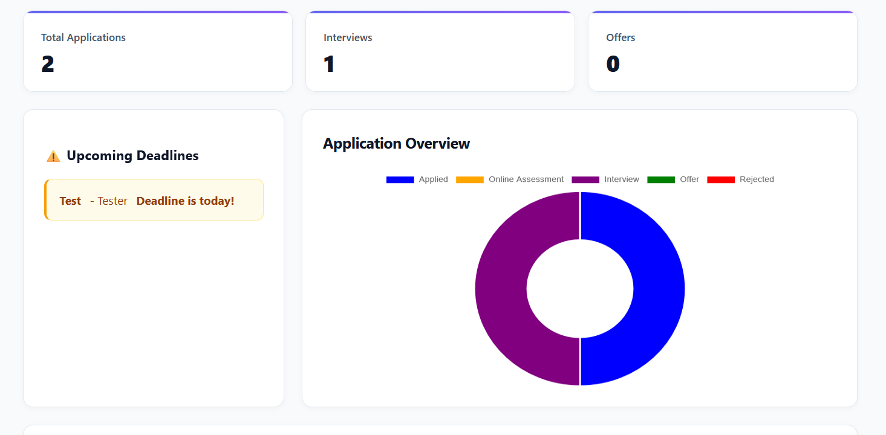

# Student Career Tracker

A full-stack web application that helps students track job and internship applications, monitor application progress, and stay aware of upcoming deadlines.

## Features

* Add job and internship applications
* View all saved applications
* Edit existing applications
* Delete applications
* Sort applications by company, role, or status
* Dashboard displaying total applications, interviews, and offers
* Deadline alerts for applications due within three days
* Interactive doughnut chart showing application status distribution
* Persistent data storage using SQLite

## Tech Stack

### Backend

* Python
* Flask
* SQLite

### Frontend

* HTML
* CSS
* JavaScript

### Libraries

* Chart.js

## Screenshots

*Add screenshots of your application here.*

For example:

### Dashboard



### Application Tracker


## Installation

### 1. Clone the repository

```bash
git clone <your-repository-url>
cd Student-Career-Tracker
```

### 2. Create and activate a virtual environment

**Windows:**

```bash
python -m venv venv
venv\Scripts\activate
```

**Mac/Linux:**

```bash
python3 -m venv venv
source venv/bin/activate
```

### 3. Install dependencies

```bash
pip install -r requirements.txt
```

### 4. Run the application

```bash
python app.py
```

Open your browser and visit:

`http://127.0.0.1:5000`

## Project Structure

```text
Student-Career-Tracker/
│
├── app.py
├── career_tracker.db
├── requirements.txt
├── README.md
│
├── templates/
│   └── index.html
│
└── static/
    ├── style.css
    └── script.js
```

## CRUD Functionality

The application implements full CRUD functionality through Flask API endpoints.

| Operation          | HTTP Method | Endpoint                 |
| ------------------ | ----------- | ------------------------ |
| Create application | POST        | `/api/applications`      |
| Get applications   | GET         | `/api/applications`      |
| Update application | PUT         | `/api/applications/<id>` |
| Delete application | DELETE      | `/api/applications/<id>` |

## Key Features

### Dashboard

The dashboard provides an overview of the user's application progress, displaying:

* Total number of applications
* Number of interviews
* Number of offers

### Deadline Notifications

Applications with deadlines within three days are automatically highlighted to help users keep track of upcoming opportunities.

### Application Status Visualisation

Chart.js is used to display an interactive doughnut chart showing the distribution of application statuses.

### Sorting

Applications can be sorted by:

* Company
* Role
* Status

## What I Learned

Through building this project, I developed my understanding of:

* Building REST-style APIs with Flask
* Integrating a frontend with a backend using JavaScript Fetch API
* Performing CRUD operations with SQLite
* Managing persistent application data
* Manipulating the DOM dynamically with JavaScript
* Working with dates and deadline calculations
* Creating interactive data visualisations with Chart.js

## Future Improvements

Potential future improvements include:

* User authentication
* Cloud database deployment
* Email deadline reminders
* Advanced search and filtering
* Exporting applications to CSV
* Application analytics over time


